# **Revisit Weakly-Supervised Audio-Visual Video Parsing from the Language Perspective**

### 主要内容概要

本文提出了一种**语言引导的段级标签去噪（LSLD）策略**。我们利用语言的泛化能力来构造提示，以指示一个段的事件出现的所有情况。了视觉语言预训练模型CLIP [7]。具体来说，CLIP用于提取所有片段的视觉特征，并计算片段与所有提示之间的相似性，以进行标签去噪。

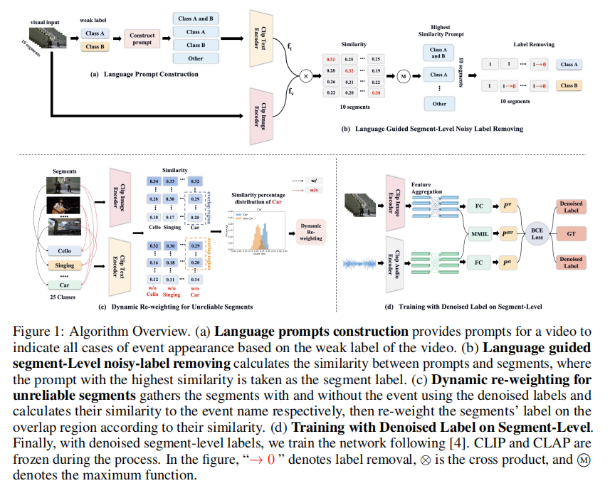

### 实验方法

#### 1、 Preliminaries

1. 视频分为T segment，文章目标是预测segment在v&a的标签
2. 特征提取器：resnet &VGGish。

采用自注意层和交叉注意层，在每个segment上聚合跨模态和单模态信息。在收集了音频和视觉特征后，可以通过FC层和s级函数获得音频和视觉的***段级***事件预测（p a t，p v t∈R1×C）。然后通过注意MMIL池对视频级预测进行聚合

#### 2、 Language Prompt Construction

 

#### 3、 Language Guided Segment-Level Label Denoising

1. 对于视觉模态，使用CLIP模型的图像编码器提取视频中每一帧的特征。对于音频模态，使用CLAP模型的音频编码器提取音频特征。
2. 将语言提示输入到CLIP的文本编码器中，得到文本特征。然后，将视频帧或音频段的特征与文本特征进行比较，计算相似度。
3. video-label是类A和类B，而segment显示prompt相似度只有A 最高，这意味着这段很可能只包含类a在这种情况下，我们把类B的噪声类段标签去噪。

#### 4、 Dynamic Re-weighting for Unreliable Segments

1. 利用去噪后的段级标签，将段分为两组：可能包含事件的段（潜在的正例）和不包含事件的段（潜在的负例）。
2. 分别计算这两组段与对应事件的语言描述之间的相似度，以获得相似度分布。通过比较这些分布，可以识别出重叠区域，即那些可能被错误标记的段。

### 实验

#### 数据集

- 使用Look, Listen and Parse (LLP)数据集进行评估，该数据集包含不同事件类别的视频片段。

#### 评估指标：

- 使用F-scores来评估音频、视觉和音频-视觉事件的解析性能，包括段级别和事件级别。

#### 特征提取器

-  使用ResNet-152 和R(2+1)D的图像编码器和VGGish的音频编码器提取特征
- 使用CLIP的图像编码器和CLAP的音频编码器提取特征。

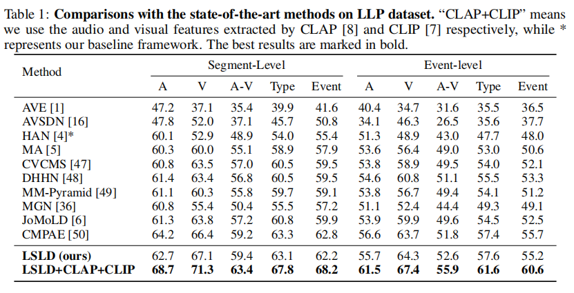

#### 消融实验

①语言引导的段级去噪（Language Guided Segment-Level Denoising, 简称 DeN）：

②动态重加权策略（Dynamic Re-weighting, 简称 ReW）：

③不同提示类型的分析：

④不同 α 和 β 值的分析：

⑤不同重加权策略的分析：

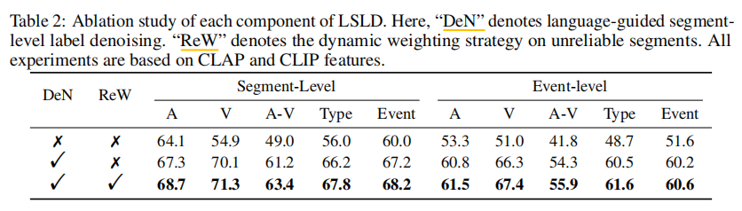

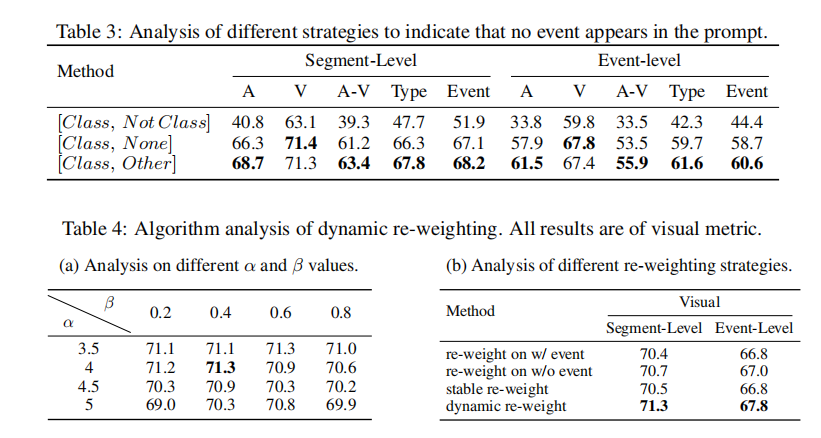

---

# **TEA: Test-time Energy Adaptation**

### 主要内容概要

目前的TTA方法未能解决基本问题：协变量偏移，即泛化性的下降可以归因于模型依赖于训练数据的边缘分布，这可能会损害模型的校准并引入确认偏差。

该文章提出了一种新的**基于能量**的视角，增强了模型对目标数据分布的感知，而不需要访问训练数据或过程。在此基础上，我们引入了**测试时间能量适应**（TEA），它将训练后的分类器转换为基于能量的模型，并将**模型的分布与测试数据对齐**，增强了其感知测试分布的能力，从而提高了整体的通用性。

### 一、Introduction

#### **TTA**

是一种迁移学习和域适应的特例，其关注将一个在source domain的预训练模型在进行预测前，适配到一个没有标签的target domain中。如下图所示，TTA只有预训练模型和测试数据（没有训练数据）。

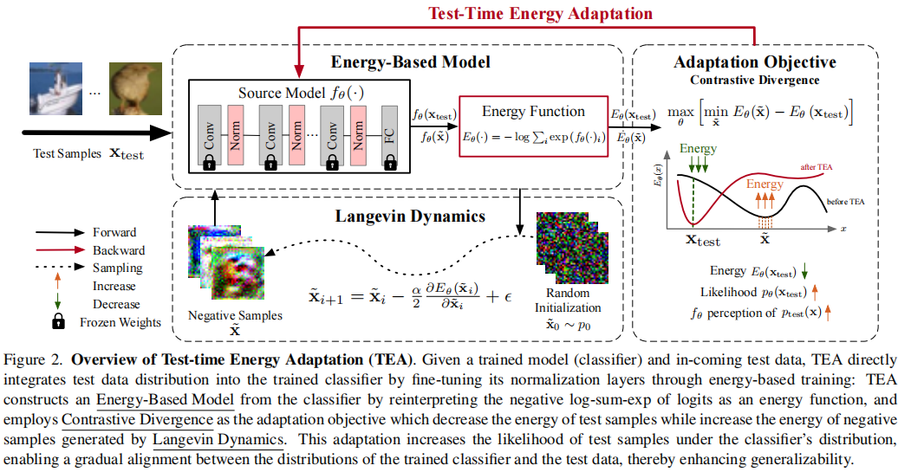

**主要方案（3种）：**

1. 基于归一化的方法用测试数据统计量来调整模型的批规范统计量。

2. 基于熵的方法通过最小化预测熵来对模型进行微调。

3. 基于伪标记的方法[34,36]利用测试时间生成的标签进行更新。

但这些方法缺乏与源域边缘分布的联系，故**引入了测试时能量适应（TEA）**，它将训练好的分类器转换为基于能量的模型，并通过对比散度作为适应目标来调整模型分布，使其与测试数据的分布对齐，从而增强模型对测试分布的感知并提高整体泛化能力。

#### **Energy Based Mode**

生成式模型，基于能量的模型（EBMs）是一种非归一化的概率模型（能量函数是一个参数为θ的 神经网络，他可以将输入一张输入图像 x 转换为一个数值）

### 二、Method

#### 1、 基本流程

1. **构建能量模型**：将训练好的分类器的logits重新解释为能量函数。

2. **对比散度优化**：使用对比散度优化，减少测试样本在模型分布下的能量，从而增加其似然。

3. **参数更新**：只更新归一化层的参数，以提高效率和实用性。

#### 2、测试分配中的能量适应

（1）构建基于能量的模型。

①构建基于能量的模型。EBM在EBM中，可以将每个样本的能量定义为由分类器输出的对数几率，即 

$$ E_\theta(\mathbf{x},y)=-f_\theta(\mathbf{x})[y] $$

其中y是类别标签

$$ p_\theta(\mathbf{x},y)=\exp(f_\theta(\mathbf{x})[y])/Z_\theta, $$

②通过对所有可能的类别标签求和，来定义样本x的联合概率分布pθ(x,y)，进而通过边缘化得到样本x的分布pθ(x)

$$ p_{\theta}(\mathbf{x})=\sum_{y}p_{\theta}(\mathbf{x},y)=\sum_{y}\exp(f_{\theta}(\mathbf{x})[y])/Z_{\theta}.\quad $$

③样本分布可以通过联合边缘概率分布（x,y）得到，如公式（3）所示，eq（3）带入（1）得到（4）能量函数，被称为logits的log-sum-exp

$$
E_{\theta}(\mathbf{x})=-\log\sum_{y}\exp\left(f_{\theta}(\mathbf{x})[y]\right).\quad
$$

（2）优化基于能量的模型。

1. 使用对比散度（Contrastive Divergence, CD）方法来估计对数似然的梯度。具体来说，通过最小化测试样本的能量并最大化由Stochastic Gradient Langevin Dynamics (SGLD) 生成的负样本的能量，来进行优化
   
   $$ \frac{\partial\log p_\theta(\mathbf{x}_{\mathrm{test}})}{\partial\theta}=\mathbb{E}_{\tilde{\mathbf{x}}\sim p_\theta}\left[\frac{\partial E_\theta\left(\tilde{\mathbf{x}}\right)}{\partial\theta}\right]-\frac{\partial E_\theta(\mathbf{x}_{\mathrm{test}})}{\partial\theta} $$
   

- 使用该技术原因：可以训练未归一化分数的模型，而能量模型不能输出一个概率，它输出的是一个在样本空间上积分不为1的分数，不能使用最大似然估计

2. SGLD是一种采样方法，它通过迭代使用梯度信息来生成样本，从而优化样本，使其朝着能量降低的方向移动。
   
   $$  \tilde{\mathbf{x}}_{t+1}=\mathbf{x}_{t}-\frac{\alpha}{2}\frac{\partial E_{\theta}\left(\tilde{\mathbf{x}}_{t}\right)}{\partial\tilde{\mathbf{x}}_{t}}+\alpha\epsilon,\quad\epsilon\sim\mathcal{N}(\mathbf{0},\mathbf{I}),  $$

   - 通过这种优化过程，模型的分布逐渐向测试数据的分布靠拢，直到达到一个低能量的稳态，此时模型对测试数据具有更高的似然性，从而提高了模型对测试数据分布的感知能力，并最终提高了泛化能力。

   - 对Langevin Dynamics来说，我们保持网络权重不变，计算输出相对于输入的梯度。然后我们在负梯度方向上对输入进行小幅度更新，从而使得在大多数迭代轮次，输出（也就是能量分数）逐渐最小化。

4. 想要训练模型以对真实观察输出较大的负能量分数，对生成的假观察输出大的正能量分数，从而使得，这两个极端的对比度越大越好。可以计算真、假样本间的能量分数差异，并用它作为我们的损失函数。

$$
\max_\theta\left[\min_{\tilde{\mathbf{x}}}E_\theta(\tilde{\mathbf{x}})-E_\theta\left(\mathbf{x}_{\mathrm{test}}\right)\right].
$$

##### 3、 调整参数

调整归一化层的参数①数量占全部参数的1%②归一化层内的参数具有捕获数据的内在特征，从而直接影响相应的数据分布的潜力

 

##### 4、 讨论（与TTA中基于熵适应的比较）

基于熵的方法，在标签空间y中应用softmax归一化并努力最小化熵，可以导致分类概率内的不确定性减少，导致模型校准受损

---

### 三、Experiment

1. ##### **实验设置**（Experimental Setup）：

   - **数据集和评估指标**：实验关注两个任务：图像损坏（image corruption）和领域泛化（domain generalization）。使用了CIFAR-10(C)、CIFAR-100(C)、TinyImageNet-200(C)和PACS数据集。评估指标包括平均准确率（Accuracy）和平均损坏误差（Mean Corruption Error, mCE）。
   - **模型架构**：使用了WideResNet-28-10、ResNet-50和ResNet-18三种架构。
   - **基线方法**：与TEA方法对比的包括基于归一化、基于熵和基于伪标签的八种TTA方法。

2. ##### **适应结果**（Adaptation Results）：

   - **图像损坏任务**：TEA在CIFAR-10(C)、CIFAR-100(C)和Tiny-ImageNet(C)数据集上的大多数损坏类型和严重级别上，都显著优于所有基线方法，平均性能提升4.7%。
   - **领域泛化任务**：在PACS数据集上，TEA在从照片和艺术领域训练后，对卡通和素描领域的泛化性能有显著提升。

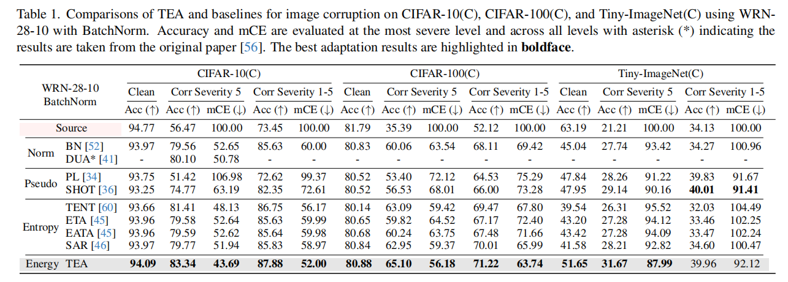

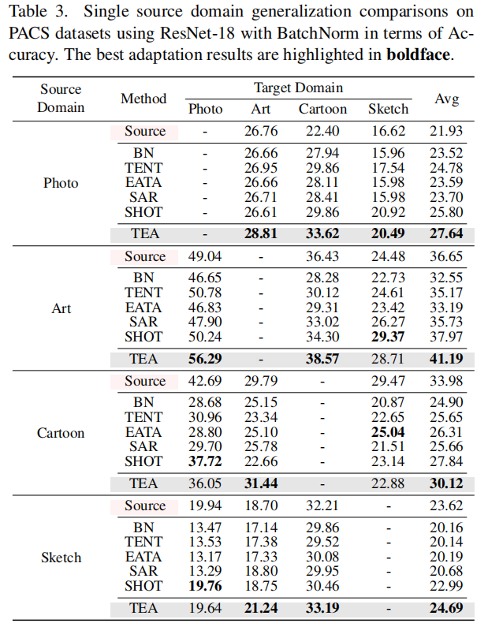

##### 3. 分析和讨论（Analysis and Discussion）：

- **能量降低与泛化能力提升的关系**：实验显示随着TEA适应步骤的增加，能量分数持续降低，损失减少，准确率提高。
- **TEA的分布感知和生成能力**：TEA能够重建在分布上与训练数据相似的测试样本，并且在显著的分布/域偏移下，仍能捕捉测试数据的关键特征。
- **TEA在校准置信度方面的改进**：与基于熵和伪标签的方法相比，TEA在CIFAR-10数据集上展示了更好的模型校准性能，减少了过自信的预测。

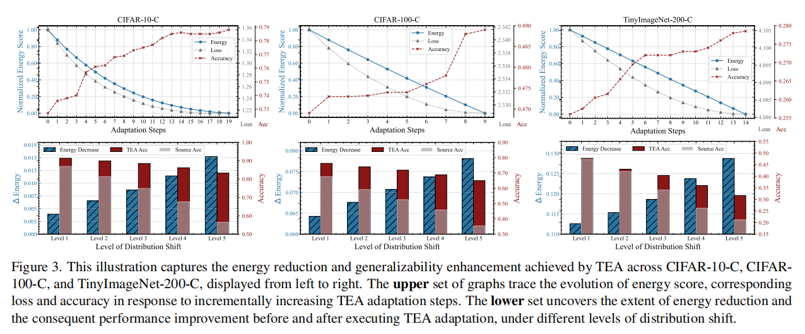

##### 4. 附加实验（Additional Experiments）：

- **能量降低的详细结果**：分析了TEA在不同损坏严重级别下的能量降低与泛化能力提升之间的关系。

- **图像损坏的详细结果**：TEA在CIFAR-10-C、CIFAR-100-C和Tiny-ImageNet-C数据集上每种损坏类型的性能。

- **超参数敏感性**：研究了TEA对SGLD学习率和步长的敏感性，结果表明TEA在广泛的超参数选择下都能保持最先进的性能。

  

---

# Test-Time Zero-Shot Temporal Action Localization

### 主要内容概要

- 介绍零镜头时间动作定位（ZS-TAL）：试图识别和定位在训练过程中看不到的未修剪的视频中的动作；

- 问题：现有的（ZS-TAL）假定了监督学习的标记数据的可用性，这在某些应用中可能是不切实际的。但实际会存在领域偏差。

- 方法：提出Test Time adaptation for Temporal Action Localization (T3AL)

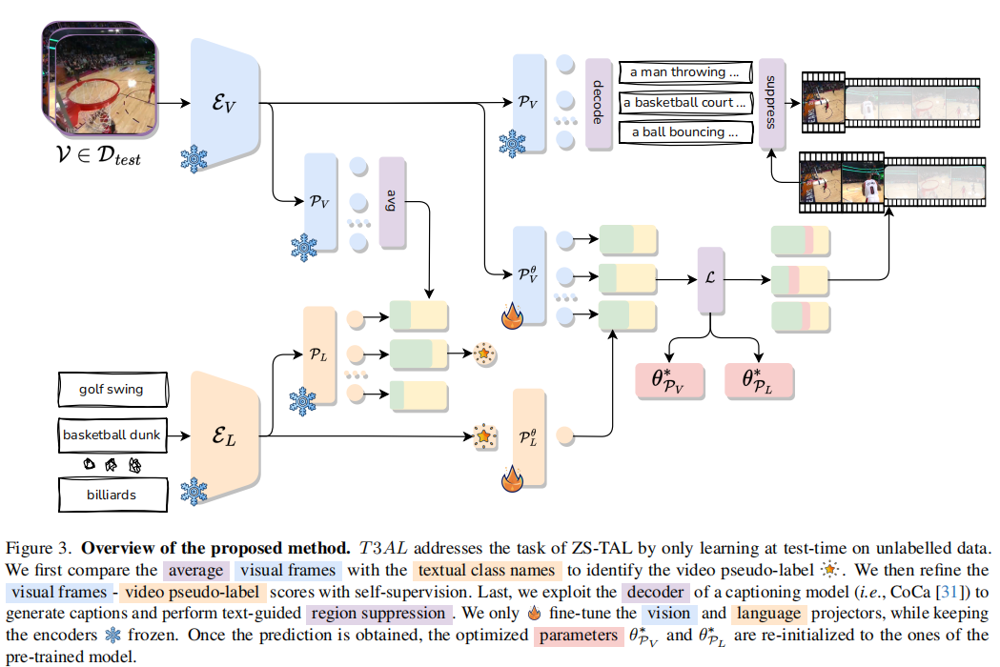

---

### 一、Introduction

训练源域的数据不可访问，所以采用了新的方法T3AL，T3AL采用了一个预先训练过的视觉和语言模型（VLM），分三个步骤操作：

1. 首先，通过聚合从整个视频中获得的信息来计算动作类别的视频级伪标签
2. 然后，采用一种受自监督学习启发的新方法进行动作定位；
3. 利用一种最先进的字幕模型提取的框架级文本描述来细化动作区域的建议。

##### Zero-Shot Temporal Action Localization：

- 要么依次解决问题，即两阶段[3,9,27,34]，要么同时解决问题，即一级[2,15,20,30]。两阶段的方法首先识别类别不可知的区域建议，然后对每个区域进行分类。单阶段方法同时进行动作定位和分类。一般需要在已知训练集上训练一个模型，难以泛化到域外，故本文选择对训练集不可访问。

##### Cross-dataset generalization analysis（跨数据集泛化分析）

1. 模型及其训练数据集
   - EffPrompt ,现成的检测器和他们在HMDB51上训练的动作识别模型
   - style：在actitynet-v1.3上训练的ZS-TAL模型

2. test dataset：THUMOS14

3. 总结
   - 第3节当测试数据集与训练数据集不一致时，EffPrompt和STALE的性能都显著下降，强调了现有ZS-TAL方法在跨数据集泛化方面的局限性，并为提出新的解决方案提供了动机和背景。

### 二、T3AL: Test Time Adaptation for Temporal Action Localization

##### 1、 video-level pseudo-labelling

在ZS-TAL任务中，测试视频可能包含在训练阶段未见过的类别。由于缺乏训练数据，模型需要一种方法来确定视频包含的动作类别。本文利用自监督学习的**伪标签**来估计视频可能包含的动作类别。

步骤：

1. 首先，使用VLM的视觉编码器从视频中提取每帧的潜在表示。
   
   $$ \bar{\mathcal{V}}=\frac{1}{N}\sum_{i=1}^{N}\mathcal{E}_{V}\left(x_{i}\right) $$

3. 然后，计算这些帧的潜在表示的平均值，以得到视频的紧凑表示（compact representation），这有助于减少非信息性帧带来的噪声。

4. 将上述紧凑表示，和VLM的语言编码器生成的动作类别的文本表示进行比较。通过计算***视频紧凑表示和每个动作类别文本表示之间的余弦相似度***，可以确定与视频内容最相关的动作类别。得到该视频的伪标签。
   
   $$ y^{*}=\underset{y\in\mathcal{C}}{\mathrm{argmax}}\cos\left(\bar{\mathcal{V}},\mathcal{E}_{L}\left(y\right)\right)  $$
   

 

##### 2、自监督的预测优化

1. 首先，根据上一步骤得到的伪标签，计算视频中每一帧与伪标签之间的语义**相似度得分s**。这些得分反映了帧与动作类别的关联程度。
   
   $$ {s}_i=\cos(\mathcal{E}_V(x_i),\mathcal{E}_L (y^*)). $$
   

3. 构建正负样本：根据相似度得分，将帧分为两组：与伪标签语义相似度高的帧作为正样本（Z+），相似度低的帧作为负样本（Z-）。这些样本将用于自监督学习过程。
   
   $$ \mathcal{Z}^+=\{\left(z_i^+,s_i^+\right)\}_{i=1}^K,\quad\mathcal{Z}^-=\{\left(z_i^-,s_i^-\right)\}_{i=1}^K $$
   

5. 自监督目标的制定：通过最小化一个特定的损失函数来适应模型参数，该损失函数包括表示损失（Representation loss）和分离损失（Separation loss）两部分。

6. 通过最小化BYOL损失函数来适应模型参数，该损失函数包括表示损失（Representation loss）和分离损失（Separation loss）两部分。

$$ \mathcal{L}=\mathcal{L}_{z}+\mathcal{L}_{s} $$

- 表示损失主要用于正样本集，目的是使属于**同一动作的帧在嵌入空间中更接近**，从而强化模型对动作的识别能力。
  
  $$ \mathcal{L}_z=2-2\cdot\frac{<z_i^+,z_j^+>}{\|z_i^+\|_2\cdot\|z_j^+\|_2} $$
  

- 分离损失同时应用于正样本和负样本，目的是推动正样本的得分更接近1，负样本的得分更接近0，从而***实现正负样本的有效分离***
  $$
  
  $$

  - 首先定义一个预测向量 s，它是由正样本和负样本的相似度得分组成的。例如，如果有两个正样本和两个负样本，预测向量 s 就是 [+1,+2,−1,−2][s+1,s+2,s−1,s−2]。
    
    $$ \mathbf{s}=\text{concat}\left(\{s_i^+\}_{i=1}^K,\{s_i^-\}_{i=1}^K\right)\in\mathbb{R}^{2K} $$
    

  - 接着定义一个二进制目标向量 b，它指示了每个样本是正样本还是负样本。对于上述例子，目标向量 b 就是 [1,1,0,0][1,1,0,0]。
    
    $$ \mathbf{b}=\begin{bmatrix}1_K\\0_K\end{bmatrix}\in\mathbb R^{2K}  $$
    

  - 在测试时适应过程中，通过计算帧得分的移动平均值来增强时间一致性，从而得到更准确的动作定位{temporal action proposals}
    
    $$ \mathcal{L}_{s}=2-2\cdot\frac{\mathrm{<s,b>}}{\|\mathbf{s}\|_{2}\cdot\|\mathbf{b}\|_{2}}. $$
    

##### 3、 Text-guided region suppression （文本引导的区域抑制）

1. 使用一个先进的字幕模型（例如CoCa）为选定的动作提议中的所有帧生成文本描述。

2. 将生成的文本描述输入语言编码器，通过对每个时间提议内的文本表示取平均，得到一个区域级文本表示，这个表示包含了该提议的语义信息。

3. 通过计算所有这些表示之间的成对余弦相似度矩阵D来建立一个拒绝准则
   
   $$ \mathbf{D}=[d_{ij}] ,\quad d_{ij}=\cos{(d_i,d_j)} $$
   

5. 将相似度矩阵D在某个阈值β下进行二值化处理，得到一个二值掩码D。对二值掩码D进行列求和，得到一个得分向量d，它衡量了每个动作提议与其他提议的相似性。
   
   $$ \mathbf{d}=\hat{\mathbf{D}}\operatorname{diag}\left(\mathbf{I}_{\hat{M}}\right)\in\mathbb{R}^{\hat{M}} $$
   

7. 如果某个提议 ^t^i 相关联的得分向量 d 中的条目低于阈值 α，则认为其相关的文本表示与其他提议的文本表示不够接近，该提议将被抑制。

8. 通过上述抑制过程，最终得到一组较为准确的动作提议 $\{(y_{i},t_{i})\}_{i=1}^{M},{{with}}  M\leq\hat{M}$ ，M 是最终保留的动作提议数量。

---

### 三、实验

1. **数据集**：

- 使用了两个数据集：THUMOS14和ActivityNet-v1.3，分别包含20和200个动作类别。

2. **评估指标**：

- 使用mean Average Precision (mAP)作为主要评估指标，计算不同时间IoU阈值下的平均精度。

3. **基线方法**：

- 作者提出了三种基于预训练视觉和语言模型（VLMs）的基线方法：CLIP32、CLIP16和CoCa，它们独立地对视频帧进行分类

4. **消融实验**：

- 分析了不同的损失函数配置对模型性能的影响，包括仅使用表示损失和分离损失，或两者结合使用。
- 研究了文本引导区域抑制步骤的有效性，该步骤利用字幕模型生成的文本描述来精细化动作提议。
- 进行了Oracle实验，以评估在理想条件下T3AL方法的潜在性能。

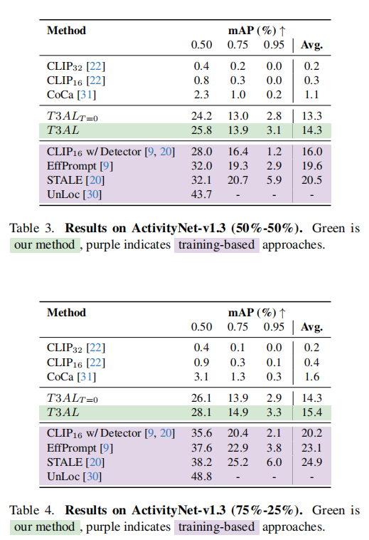

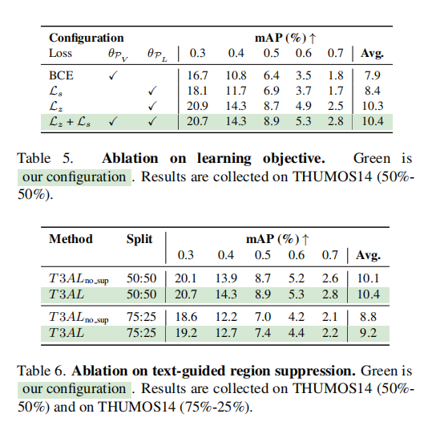
